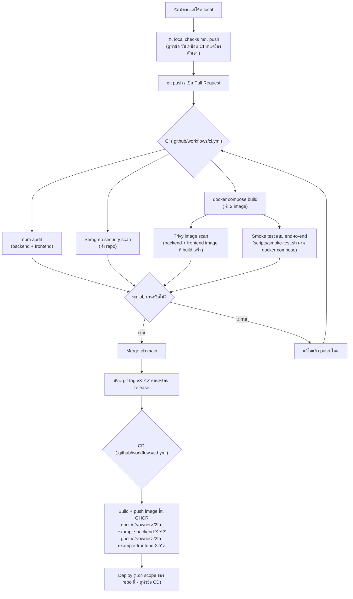

# CI/CD Pipeline

เอกสารนี้อธิบาย**กระบวนการพัฒนา** (dev workflow) ของโปรเจกต์นี้ตั้งแต่แก้โค้ดจนถึง publish image —
ทั้ง CI (ตรวจสอบคุณภาพ/ความปลอดภัยอัตโนมัติทุกครั้งที่แก้โค้ด) และ CD (build/publish image ตอน release)

> **กฎสำคัญ:** [CLAUDE.md](CLAUDE.md) กำหนดให้อ่านไฟล์นี้ทุกครั้งก่อนเริ่มแก้ไข/เพิ่ม feature ใหม่
> เพื่อให้ขั้นตอนการพัฒนาสอดคล้องกับที่ pipeline บังคับไว้ ไม่ใช่มาพังตอน CI รันทีหลัง

## ภาพรวม



## CI — ตรวจสอบอัตโนมัติทุก push/PR

Implementation จริงอยู่ที่ [.github/workflows/ci.yml](.github/workflows/ci.yml) รันทุกครั้งที่ push เข้า
`main` หรือเปิด Pull Request มี 5 job ที่ต้องผ่านทั้งหมด:

| Job | ทำอะไร | ทำไมต้องมี |
|---|---|---|
| `audit` | `npm audit --audit-level=high` ทั้ง `backend/` และ `frontend/` (แยก job ด้วย matrix) | จับ dependency ที่มีช่องโหว่รู้จักแล้วก่อนที่จะหลุดเข้า image |
| `security-scan` | รัน [Semgrep](https://semgrep.dev) (ผ่าน Docker image `semgrep/semgrep`) ด้วย ruleset `p/security-audit`, `p/secrets`, `p/javascript`, `p/nodejsscan` แล้ว `--error` (fail ถ้าเจอ finding) | จับ pattern ที่เป็นช่องโหว่จริง เช่น GCM ที่ไม่ pin auth tag length, secret ที่ hardcode ในโค้ด — วิธีเดียวกับที่ใช้ตรวจโปรเจกต์นี้จริงตอนพัฒนา (ดู [CLAUDE.md](CLAUDE.md#ผลการสแกนความปลอดภัย)) |
| `build` | `docker compose build` — build ทั้ง backend และ frontend image | กัน Dockerfile พังแบบไม่มีใครรู้จนกว่าจะ deploy จริง |
| `image-scan` | รัน [Trivy](https://trivy.dev) (ผ่าน [aquasecurity/trivy-action](https://github.com/aquasecurity/trivy-action)) สแกน image ที่ build เสร็จของทั้ง backend/frontend หา CRITICAL/HIGH ที่มี fix แล้ว | `audit`/`security-scan` ดูแค่ source กับ `package.json` — ไม่เห็นช่องโหว่ที่มาจาก OS package ของ base image (เช่น `libssl`/`libcrypto` ของ Alpine) หรือ dependency ที่ resolve จริงตอน build เท่านั้นที่ image scan เห็น |
| `smoke-test` | `docker compose up -d --build` แล้วรัน [scripts/smoke-test.sh](scripts/smoke-test.sh) ยิง API จริงทั้ง flow: login บังคับ 2FA setup → ยืนยันโค้ด TOTP → ได้ backup codes → เปลี่ยนรหัสผ่าน → admin สร้าง user → RBAC ปฏิเสธ user ธรรมดาที่เรียก `/admin/users` (403) → logout แล้ว `/me` เป็น 401 | Unit test ไม่พอสำหรับระบบที่หัวใจคือ "สถานะไหลผ่าน service หลายตัว" (login → 2FA → session → RBAC) — smoke test นี้คือชุดเดียวกับที่ยืนยัน flow ทั้งหมดด้วยมือตอนพัฒนาฟีเจอร์ 2FA/RBAC/SSO ครั้งแรก แปลงเป็น script ที่รันซ้ำได้ |

ทั้ง 5 job รันพร้อมกัน (ไม่ block กันเอง) ยกเว้น `image-scan`/`smoke-test` ที่รอ `build` ผ่านก่อน (ไม่มี
ประโยชน์จะสแกน/รันสแตกที่ build ไม่ผ่าน) PR จะ merge ได้ก็ต่อเมื่อทุก job เขียวหมด — ไม่มี job ไหนเป็น
"optional"

### Trivy เจอ noise จาก base image เยอะ — จัดการยังไง

Scan image ทั้งใบเจอช่องโหว่ที่ไม่เกี่ยวกับแอปเราเลยด้วย 2 กลุ่ม (verify แล้วจริงตอนพัฒนา ไม่ใช่เดา):

1. **npm CLI เองมี dependency ของตัวเอง** (`tar`, `glob`, `minimatch`, ...) อยู่ใต้
   `/usr/local/lib/node_modules/npm/node_modules/` — เป็น dependency ของ npm ตอนติดตั้ง package
   ไม่ใช่ของแอปเรา (แอปเราอยู่ที่ `/app/node_modules`) และไม่ถูกเรียกใช้ตอน container รันจริงเลย
   → ใช้ `skip-dirs` ตัด path นี้ออกจากการสแกนไปเลย (ไม่ไล่ ignore เป็นราย CVE เพราะจะโผล่ CVE ใหม่
   เรื่อย ๆ ทุกครั้งที่ base image อัปเดต)
2. **esbuild** (dependency ของ Vite) เป็น binary ที่ compile จาก Go — Trivy เห็น Go stdlib module
   ที่ฝังอยู่ในตัว binary แล้วเจอ CVE ของ `net`/`net/http`/`net/mail` ของ Go ทั้งที่ไม่เกี่ยวกับแอปเรา
   เลย (esbuild ใช้แปลงไฟล์ source ของเราเองในเครื่อง ไม่เปิด network service ที่ exercise
   code path พวกนั้น) → ใช้ `skip-files` ตัด binary path ออก
3. **`vite` เอง** (dependency จริงของเรา) มี CVE หนึ่งตัว (`server.fs.deny` bypass ผ่าน Windows
   alternate path) ที่ fix ต้องขึ้น Vite 6+ ซึ่งต้องใช้ Svelte 5 (ติด constraint เดียวกับที่บันทึกไว้ใน
   [CLAUDE.md](CLAUDE.md#ผลการสแกนความปลอดภัย) เรื่อง esbuild/Svelte SSR) — exploit ต้องรันบน
   Windows filesystem แต่ container เรารันบน Linux เสมอไม่ว่า host จะเป็น OS ไหน จึงไม่มี code path
   ที่ exploit ได้จริง → ใส่ไว้ใน [frontend/.trivyignore](frontend/.trivyignore) พร้อมเหตุผลกำกับ

ส่วนที่ Trivy จับได้จริงและแก้แล้ว: **OpenSSL (`libssl`/`libcrypto`) ของ Alpine base image เก่ากว่า
patch ล่าสุด** — เพิ่ม `RUN apk update && apk upgrade --no-cache` ในทั้ง 2 Dockerfile ให้ดึง OS package
security patch ล่าสุดตอน build เสมอ ไม่พึ่งแค่เวอร์ชันที่ฝังมากับ base image ตอนนั้น

### สแกน docker-compose.keycloak.yml ด้วยหรือไม่?

**ไม่** — CI รันแค่ `docker-compose.yml` (ไม่มี Keycloak) เพราะ:
1. เร็วกว่ามาก (ไม่ต้อง pull/boot Keycloak ทุก PR)
2. Flow ของ Keycloak ใช้โค้ด**เดียวกัน**กับ generic OIDC (`oidcClient.service.js`) ที่ทดสอบผ่าน
   `smoke-test.sh` ทางอ้อมอยู่แล้วในแง่ "ระบบ 2FA/RBAC ไม่พังเมื่อ user ไม่มีรหัสผ่าน local" (สร้าง user
   ผ่าน admin API ให้ role `user`) — ส่วนที่ Keycloak เพิ่มมาเฉพาะคือ HTTP redirect chain ซึ่งได้ทดสอบมือ
   แบบ end-to-end ไปแล้วตอนพัฒนา (ดู [CLAUDE.md](CLAUDE.md#sso--oidc-facebook-line-keycloak-generic-oidc))
3. ถ้าจะเพิ่ม smoke test สำหรับ Keycloak ใน CI จริง ๆ ต้อง mock ฟอร์ม login ของ Keycloak (ไม่มี API
   แบบ `curl` ตรง ๆ) — เป็นแนวทางต่อยอดที่บันทึกไว้ใน README แล้ว ไม่ได้ตัดทิ้งเพราะมองว่าไม่สำคัญ
   แต่เพราะ cost/benefit ยังไม่คุ้มในตอนนี้

## รันเหมือน CI บนเครื่องตัวเอง (ก่อน push)

```bash
# 1) audit dependency
cd backend && npm ci && npm audit --audit-level=high && cd ..
cd frontend && npm ci && npm audit --audit-level=high && cd ..

# 2) security scan (ใช้ Docker, ไม่ต้องติดตั้ง semgrep เอง)
docker run --rm -v "$PWD:/src" semgrep/semgrep \
  semgrep scan --config p/security-audit --config p/secrets --config p/javascript --config p/nodejsscan \
  --exclude node_modules --exclude "*.md" --error /src

# 3) build
docker compose build

# 4) image scan (ใช้ Docker, ไม่ต้องติดตั้ง trivy เอง)
docker build -t 2fa-example-backend:scan ./backend
docker build -t 2fa-example-frontend:scan ./frontend
docker run --rm -v /var/run/docker.sock:/var/run/docker.sock aquasec/trivy:latest image \
  --severity CRITICAL,HIGH --ignore-unfixed \
  --skip-dirs /usr/local/lib/node_modules/npm 2fa-example-backend:scan
docker run --rm -v /var/run/docker.sock:/var/run/docker.sock -v "$PWD/frontend/.trivyignore:/tmp/.trivyignore" aquasec/trivy:latest image \
  --severity CRITICAL,HIGH --ignore-unfixed --ignorefile /tmp/.trivyignore \
  --skip-dirs /usr/local/lib/node_modules/npm \
  --skip-files /app/node_modules/esbuild/bin/esbuild \
  --skip-files /app/node_modules/@esbuild/linux-x64/bin/esbuild \
  2fa-example-frontend:scan

# 5) smoke test แบบเต็ม
bash scripts/generate-secrets.sh   # ถ้ายังไม่มี .env
docker compose up -d --build
bash scripts/smoke-test.sh
docker compose down -v
```

ถ้า 5 ขั้นตอนนี้ผ่านบนเครื่องตัวเอง CI แทบไม่มีทางไม่ผ่าน (เป็น environment เดียวกัน คือ Docker)

## CD — publish image ตอน release

Implementation อยู่ที่ [.github/workflows/cd.yml](.github/workflows/cd.yml) trigger ด้วย git tag รูปแบบ
`vX.Y.Z` (semantic versioning) เท่านั้น — ไม่ trigger จาก push ปกติเข้า `main`

ทำงาน 2 อย่างต่อ service (backend, frontend):
1. Build image จาก `Dockerfile` ของ service นั้น
2. Push ขึ้น [GitHub Container Registry](https://ghcr.io) เป็น 2 tag: เลขเวอร์ชันที่ tag ไว้ (เช่น
   `ghcr.io/<owner>/2fa-example-backend:1.2.0`) และ `:latest`

### ทำไมไม่ deploy ต่อให้เลย

โปรเจกต์นี้เป็นตัวอย่างเพื่อการเรียนรู้ ไม่มี server/target จริงที่ตายตัว (ไม่รู้ว่าผู้ใช้จะ deploy ไป
VM, Kubernetes, หรือ platform ไหน) — การ publish image ที่ผ่านการทดสอบแล้วคือจุดที่ "ปลอดภัยและมีประโยชน์
กับทุกคน" ที่สุดที่จะหยุดไว้ ส่วนขั้นตอน deploy จริงปล่อยให้เป็นจุดต่อยอด (pluggable) ตามหัวข้อ
[แนวทางต่อยอด](README.md#-แนวทางต่อยอด) ของ README — ถ้าจะต่อ ให้เพิ่ม job ใหม่ใน `cd.yml` ที่ทำงาน
หลัง publish สำเร็จ เช่น `ssh` ไป pull image ใหม่บน VM, หรือ trigger webhook ของ platform ที่ใช้

### Rollback

เพราะทุก image ถูก tag ด้วยเลขเวอร์ชันที่ immutable (ไม่ใช่แค่ `latest`) การ rollback คือสั่ง deploy
ด้วย tag เวอร์ชันก่อนหน้าตรง ๆ (`docker pull ghcr.io/<owner>/2fa-example-backend:1.1.0`) ไม่ต้อง build
ใหม่ ไม่ต้อง revert commit ก่อน deploy — เก็บ image เวอร์ชันเก่าไว้เสมอ (ไม่ลบ tag ที่เคย release)

## Branching และ versioning

- Branch เดียว: `main` — PR ทุกอันต้องผ่าน CI ครบก่อน merge ไม่มี long-lived branch อื่น (repo เดี่ยว
  ขนาดเล็ก ยังไม่จำเป็นต้องมี `develop`/`release/*` branch)
- Versioning ตาม [Semantic Versioning](https://semver.org): `vMAJOR.MINOR.PATCH`
  - MAJOR: breaking change ที่ผู้ใช้เดิมต้องแก้ตาม (เช่น เปลี่ยนรูปแบบ migration ที่ไม่ backward compatible)
  - MINOR: เพิ่มฟีเจอร์ใหม่แบบไม่ breaking (เช่น เพิ่ม SSO provider ใหม่)
  - PATCH: bug fix / security fix ที่ไม่เพิ่มฟีเจอร์
- Tag สร้างจาก `main` เท่านั้น หลังจากที่ commit นั้นผ่าน CI บน `main` แล้ว (ไม่ tag branch อื่น)

## Secrets/permissions ที่ workflow ต้องใช้

| Workflow | ต้องการ | หมายเหตุ |
|---|---|---|
| `ci.yml` | ไม่ต้องตั้งค่าอะไรเพิ่ม | `scripts/generate-secrets.sh` สร้าง secret แบบสุ่มใช้ครั้งเดียวสำหรับรัน smoke test เท่านั้น ไม่ใช่ secret จริง |
| `cd.yml` | `permissions: packages: write` (ประกาศในไฟล์แล้ว) + `secrets.GITHUB_TOKEN` (GitHub ให้มาอัตโนมัติ) | ไม่ต้องสร้าง PAT หรือ secret เพิ่มเองเพื่อ push ขึ้น GHCR ของ repo ตัวเอง |

## เพิ่มเติม: ทำไมต้องมี CLAUDE.md ชี้มาที่ไฟล์นี้

Requirement ของโปรเจกต์นี้ระบุไว้ชัดว่าทุกครั้งที่แก้ไข feature ต้องทำตามกระบวนการ CI/CD ที่ออกแบบไว้ —
[CLAUDE.md](CLAUDE.md) จึงมีคำสั่งให้อ่านไฟล์นี้ก่อนเริ่มงานทุกครั้ง เพื่อให้ (1) รู้ว่าต้องรัน check อะไร
ก่อน push (หัวข้อ "รันเหมือน CI บนเครื่องตัวเอง" ด้านบน) และ (2) รู้ว่าถ้าเพิ่ม dependency ใหม่/แก้
Dockerfile/เปลี่ยน endpoint ต้องอัปเดต `scripts/smoke-test.sh` ให้ครอบคลุม flow ใหม่ด้วยหรือไม่ ไม่ใช่แค่
เขียนโค้ดเสร็จแล้วจบ

## แนวทางต่อยอด CI/CD

- เพิ่ม Dependabot (`.github/dependabot.yml`) ให้เปิด PR อัปเดต dependency อัตโนมัติ แล้วให้ `ci.yml`
  ตรวจสอบ PR นั้นเหมือน PR ปกติ
- เพิ่ม job แยกสำหรับ scan `docker-compose.keycloak.yml` (ทดสอบ Keycloak flow แบบ headless เช่นใช้
  Playwright กรอกฟอร์ม login ของ Keycloak จริง)
- เพิ่ม staging environment: deploy image ที่ build จาก `main` ไปที่ staging อัตโนมัติทุกครั้งที่ merge
  ก่อนจะ tag เป็น release จริง
