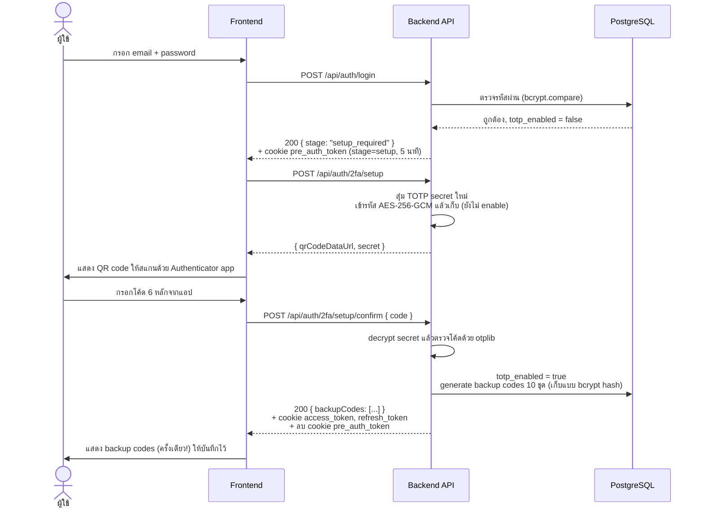
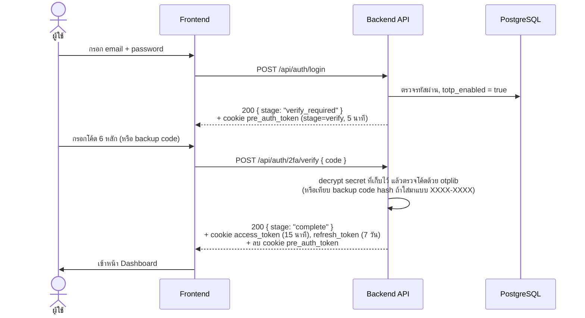

# 🔐 2FA Example — Login + RBAC + บังคับ 2FA (TOTP)

โปรเจกต์ตัวอย่างสำหรับ **เรียนรู้การสร้างระบบ Login ที่บังคับ 2FA กับผู้ใช้ทุกคน** พร้อมระบบ
**RBAC (Role-Based Access Control)** และหน้าบริหารจัดการผู้ใช้ — เขียนขึ้นเพื่อให้อ่านโค้ดแล้วเข้าใจ
"วิธีทำงานจริง" ของ TOTP 2FA, JWT session, การเข้ารหัส/hash ข้อมูลลับ และ RBAC ไม่ใช่แค่เอาไปรันอย่างเดียว

> ⚠️ **นี่คือโปรเจกต์เพื่อการศึกษา** ไม่ควรนำขึ้น production ตรง ๆ โดยไม่ผ่านการรีวิวความปลอดภัยเพิ่มเติม
> (ดูหัวข้อ [ข้อจำกัดที่ตั้งใจไว้](#-ข้อจำกัดที่ตั้งใจไว้))

## สารบัญ

- [เทคโนโลยีที่ใช้](#-เทคโนโลยีที่ใช้)
- [สถาปัตยกรรมระบบ](#-สถาปัตยกรรมระบบ)
- [เริ่มใช้งาน (Quick Start)](#-เริ่มใช้งาน-quick-start)
- [ขั้นตอนการทำงานของ 2FA](#-ขั้นตอนการทำงานของ-2fa) — หัวใจของโปรเจกต์นี้
- [RBAC ทำงานอย่างไร](#-rbac-ทำงานอย่างไร)
- [ความลับถูกเก็บอย่างไร: hash vs encrypt](#-ความลับถูกเก็บอย่างไร-hash-vs-encrypt)
- [Session & Token](#-session--token)
- [โครงสร้างโปรเจกต์](#-โครงสร้างโปรเจกต์)
- [ตัวแปรแวดล้อม (Environment Variables)](#-ตัวแปรแวดล้อม-environment-variables)
- [API Reference](#-api-reference)
- [ข้อจำกัดที่ตั้งใจไว้](#-ข้อจำกัดที่ตั้งใจไว้)
- [แนวทางต่อยอด](#-แนวทางต่อยอด)

## 🛠 เทคโนโลยีที่ใช้

| ส่วน | เทคโนโลยี |
|---|---|
| Frontend | [Svelte 4](https://svelte.dev) + [Vite](https://vitejs.dev) + [svelte-spa-router](https://github.com/ItalyPaleAle/svelte-spa-router) |
| Backend | [Node.js 20](https://nodejs.org) + [Express](https://expressjs.com) |
| Database | [PostgreSQL 16](https://www.postgresql.org) (ผ่าน `pg` driver, raw SQL — ไม่ใช้ ORM เพื่อให้เห็น query ตรง ๆ) |
| 2FA | [otplib](https://github.com/yeojz/otplib) (TOTP) + [qrcode](https://github.com/soldair/node-qrcode) |
| Auth | [jsonwebtoken](https://github.com/auth0/node-jsonwebtoken) (JWT ใน httpOnly cookie), [bcryptjs](https://github.com/dcodeIO/bcrypt.js) |
| Infra | Docker + Docker Compose |

## 🏗 สถาปัตยกรรมระบบ


Browser คุยกับ origin เดียวคือ `localhost:5173` เท่านั้น — Vite dev server proxy คำขอที่ขึ้นต้นด้วย
`/api` ไปยัง container `backend` ให้เอง (ดู [frontend/vite.config.js](frontend/vite.config.js))
ทำให้ cookie ที่ backend เซ็ตเป็น **same-origin เสมอ** ไม่ต้องยุ่งกับ CORS/`SameSite=None` ที่ซับซ้อน
ซึ่งเป็นกับดักที่คนเขียนระบบ auth แบบ SPA + API แยกกันมักเจอ

## 🚀 เริ่มใช้งาน (Quick Start)

### สิ่งที่ต้องมี

- [Docker](https://www.docker.com/) และ Docker Compose (มาพร้อม Docker Desktop)
- [OpenSSL](https://www.openssl.org/) (มีอยู่แล้วใน macOS/Linux, บน Windows ใช้ Git Bash ก็มี) สำหรับ generate secret

### ขั้นตอน

**1. คัดลอกไฟล์ .env ตัวอย่าง**

```bash
cp .env.example .env
cp backend/.env.example backend/.env
cp frontend/.env.example frontend/.env
```

**2. Generate secret สำหรับ backend/.env** — ห้ามใช้ค่า placeholder ที่มาพร้อมไฟล์ตัวอย่างจริง ๆ

```bash
# รันคำสั่งนี้ 3 รอบ แล้วเอาผลลัพธ์แต่ละรอบไปแทนที่ ACCESS_TOKEN_SECRET,
# REFRESH_TOKEN_SECRET, PRE_AUTH_TOKEN_SECRET ใน backend/.env (คนละค่ากันทั้ง 3 ตัว)
openssl rand -hex 64

# รันคำสั่งนี้ 1 รอบ แทนที่ TOTP_ENCRYPTION_KEY ใน backend/.env
openssl rand -hex 32
```

**3. แก้รหัสผ่านฐานข้อมูลและ admin เริ่มต้น (แนะนำ)**

เปิด `.env` (root) แก้ `POSTGRES_PASSWORD`, และเปิด `backend/.env` แก้ `ADMIN_EMAIL` / `ADMIN_PASSWORD`
ให้เป็นค่าของคุณเอง (ต้อง sync `POSTGRES_PASSWORD` ให้ตรงกันทั้ง root `.env` เท่านั้น — ดู
[docker-compose.yml](docker-compose.yml) ที่ forward ค่านี้เข้า backend container ให้อัตโนมัติแล้ว)

**4. Build และรัน**

```bash
docker compose up -d --build
```

รอสักครู่ — backend จะรัน database migration และสร้างบัญชี admin เริ่มต้นให้อัตโนมัติตอน start
(ดู log ด้วย `docker compose logs -f backend`)

**5. เปิดเว็บ**

เปิด [http://localhost:5173](http://localhost:5173) แล้ว login ด้วยค่าใน `backend/.env`:
`ADMIN_EMAIL` / `ADMIN_PASSWORD` — ระบบจะบังคับให้ตั้ง 2FA และเปลี่ยนรหัสผ่านทันทีตั้งแต่ครั้งแรกที่ login

### คำสั่งอื่น ๆ ที่มีประโยชน์

```bash
docker compose logs -f backend    # ดู log ของ API
docker compose down               # หยุดทุก service (เก็บข้อมูลใน DB ไว้)
docker compose down -v            # หยุด + ล้างฐานข้อมูลทั้งหมด (รอบต่อไปจะ seed admin ใหม่)
```

## 🔑 ขั้นตอนการทำงานของ 2FA

นี่คือส่วนสำคัญที่สุดของโปรเจกต์นี้ ถ้าเข้าใจ flow นี้ก็เข้าใจหัวใจของระบบทั้งหมด

**หลักการ:** การ login ด้วย email + password อย่างเดียว **ไม่มีทางทำให้ได้ session ที่ใช้เรียก API
อื่นได้เลย** ไม่ว่า role ไหนก็ตาม — รหัสผ่านที่ถูกต้องจะได้แค่ **"pre-auth token"** อายุสั้น (5 นาที)
ที่พาไปต่อยอดกับ 2FA เท่านั้น ไม่สามารถใช้เรียก endpoint อื่นที่ต้อง login ได้

### กรณีที่ 1: ผู้ใช้ยังไม่เคยตั้ง 2FA (บังคับตั้งใหม่)



### กรณีที่ 2: ผู้ใช้ตั้ง 2FA ไว้แล้ว (login ปกติ)



### สิ่งที่ทำให้ 2FA เป็น "บังคับจริง" ไม่ใช่แค่ตัวเลือก

1. **ไม่มี branch ไหนใน `login` controller ที่ออก session เต็มได้เลย** — ดูโค้ดจริงที่
   [backend/src/controllers/auth.controller.js](backend/src/controllers/auth.controller.js) ฟังก์ชัน
   `login` จะเห็นว่าทุก path (ไม่ว่า `totp_enabled` จะเป็น true หรือ false) จบด้วยการออก
   pre-auth token เท่านั้น ไม่มี `issueFullSession()` ปนอยู่เลย
2. **Admin ปิด 2FA ให้ user ไม่ได้** มีแต่ "reset" (`POST /api/admin/users/:id/reset-2fa`) ซึ่งแค่ล้าง
   secret เดิมทิ้ง — ผลคือ user คนนั้น login ครั้งหน้าจะตกไปกรณีที่ 1 (บังคับตั้งใหม่) ทันที ไม่ใช่ทางลัด
   ให้ข้าม 2FA แต่อย่างใด
3. **pre-auth token เซ็นด้วย secret คนละตัว** (`PRE_AUTH_TOKEN_SECRET`) จาก access token
   (`ACCESS_TOKEN_SECRET`) — แม้โค้ดจะมี bug ที่ไหนสักที่ที่ดันเอา pre-auth token ไปเข้า middleware
   ตรวจ access token ก็ verify ไม่ผ่านอยู่ดี เพราะ secret ไม่ตรงกัน

### Backup codes

ตอนตั้ง 2FA สำเร็จ (หรือกด "regenerate" ในหน้า Profile) ระบบจะสุ่ม backup code 10 ชุด รูปแบบ
`XXXX-XXXX` แสดงให้ผู้ใช้เห็น **ครั้งเดียว** แล้วเก็บแค่ bcrypt hash ไว้ในตาราง `backup_codes` — ใช้แทน
โค้ด TOTP ได้ตอน verify (ระบบเดา format จาก `XXXX-XXXX` เทียบกับ 6 หลักตัวเลข) แต่ละโค้ดใช้ได้ครั้งเดียว
แล้วจะถูก mark `used_at` ทันที

## 🛂 RBAC ทำงานอย่างไร

มี 3 role: `admin`, `manager`, `user` — permission ทั้งหมดกำหนดจากที่เดียวใน
[backend/src/config/permissions.js](backend/src/config/permissions.js):

```js
export const PERMISSIONS = {
  'users:read':  ['admin', 'manager'],  // manager ดูรายชื่อ user ได้ แก้ไขไม่ได้
  'users:write': ['admin'],             // สร้าง/แก้ role/reset ต่าง ๆ — admin เท่านั้น
  'audit:read':  ['admin'],             // ดู audit log — admin เท่านั้น
};
```

Middleware `requirePermission('users:write')` เช็ค `req.user.role` กับ map นี้ก่อนเข้าตัว controller
ทุกครั้ง (ดู [backend/src/middleware/rbac.middleware.js](backend/src/middleware/rbac.middleware.js))
เพิ่ม role หรือ permission ใหม่ แก้ที่ไฟล์เดียวนี้พอ ไม่ต้องไล่แก้ทุก route

ตัวอย่างการปฏิเสธจริง: `user` role เรียก `GET /api/admin/users` จะได้ `403 Forbidden` ทันที แม้จะมี
access token ที่ valid อยู่ก็ตาม เพราะการ login สำเร็จ ≠ มีสิทธิ์ทำทุกอย่าง

## 🔒 ความลับถูกเก็บอย่างไร: hash vs encrypt

ข้อกำหนดของโปรเจกต์นี้คือ **credential ทุกตัวเก็บในไฟล์ `.env`** (ไม่ hardcode ในโค้ด) และ
**secret ที่เก็บในฐานข้อมูลต้องไม่เก็บเป็นข้อความล้วน (plaintext)** — แต่ "hash" กับ "encrypt" ใช้ต่างกัน
คนละกรณี ตามตารางนี้:

| ข้อมูล | เก็บด้วย | ทำไม |
|---|---|---|
| รหัสผ่านผู้ใช้ | **bcrypt hash** (one-way) | ระบบไม่จำเป็นต้องรู้รหัสผ่านจริงเลย แค่เทียบว่า hash ตรงกันไหมตอน login |
| Backup codes | **bcrypt hash** (one-way) | เป็น secret สุ่มที่ใช้ครั้งเดียวทิ้ง เหมือนรหัสผ่าน — ไม่ต้องเอาค่าจริงมาโชว์ซ้ำอีก |
| TOTP secret | **AES-256-GCM encrypt** (two-way) | ระบบ**ต้อง**ถอดกลับเป็นค่าจริงได้ทุกครั้งที่ผู้ใช้ login เพื่อคำนวณโค้ด TOTP ที่คาดหวัง ณ เวลานั้น จะ hash แบบ one-way ไม่ได้เลยเพราะไม่มีทางย้อนกลับ |
| Refresh token | **SHA-256 hash** | ตัว token เองสุ่มจาก JWT ที่ entropy สูงมากอยู่แล้ว (ไม่ใช่คำที่คนจำได้แบบรหัสผ่าน) ไม่จำเป็นต้องใช้ bcrypt ที่ตั้งใจให้คำนวณช้าเพื่อกันเดา — SHA-256 พอสำหรับเทียบว่า token ที่ส่งมาตรงกับที่ DB เก็บไว้ |

จุดที่มักเข้าใจผิด: **TOTP secret เข้ารหัส ไม่ได้ hash** เพราะการ hash เป็น one-way (ทำแล้วย้อนกลับไม่ได้)
แต่ TOTP ต้องเอา secret ตัวจริงไปคำนวณ HMAC-SHA1 ทุกครั้งที่ตรวจโค้ด ถ้า hash secret ไว้ ระบบจะไม่มีวัน
ตรวจโค้ดจากแอปผู้ใช้ได้อีกเลย จึงต้องใช้ **AES-256-GCM** (symmetric encryption ที่ถอดกลับได้ด้วย key
ที่เก็บใน `.env` — `TOTP_ENCRYPTION_KEY`) แทน

## 🍪 Session & Token

| Cookie | อายุ | Secret (env var) |
|---|---|---|
| `pre_auth_token` | 5 นาที | `PRE_AUTH_TOKEN_SECRET` |
| `access_token` | 15 นาที | `ACCESS_TOKEN_SECRET` |
| `refresh_token` | 7 วัน | `REFRESH_TOKEN_SECRET` |

ทั้งหมดเป็น **httpOnly cookie** (JavaScript ฝั่ง browser อ่านไม่ได้ กัน XSS ขโมย token ไปใช้)
`SameSite=Lax` และ `Secure` เปิด/ปิดตาม `COOKIE_SECURE` ใน `.env` (เปิดเมื่อรันผ่าน HTTPS จริง)

`refresh_token` ถูก **rotate ทุกครั้งที่ใช้**: เรียก `POST /api/auth/refresh` แต่ละครั้ง token เก่าจะถูก
revoke (mark ในตาราง `refresh_tokens`) แล้วออกตัวใหม่ทันที ถ้ามีใครเอา refresh token ที่ revoke ไปแล้ว
มาใช้ซ้ำ (สัญญาณว่าโดนขโมย token ไปแล้วมีคนใช้คนละที่กัน) ระบบจะ revoke session **ทั้งหมด** ของ user
คนนั้นทันที เพื่อบังคับให้ login ใหม่

## 📁 โครงสร้างโปรเจกต์

```
2FA-example-coding/
├── docker-compose.yml
├── .env.example                # ตัวแปรระดับ infra (DB credential, ports)
├── backend/
│   ├── Dockerfile
│   ├── .env.example            # JWT secret, TOTP key, admin bootstrap ฯลฯ
│   └── src/
│       ├── config/              env.js (validate ด้วย zod), db.js, permissions.js
│       ├── db/                  migrations/, migrate.js, seed.js
│       ├── middleware/          auth, rbac, rateLimit, error
│       ├── validators/          zod schema ของทุก request
│       ├── services/            business logic (user/token/twofa/audit)
│       ├── controllers/         auth.controller.js, admin.controller.js
│       └── routes/
└── frontend/
    ├── Dockerfile
    ├── .env.example
    └── src/
        ├── lib/                 api.js, guards.js, stores/
        ├── pages/                1 ไฟล์ต่อ 1 หน้า (Login, Setup2FA, Verify2FA, AdminUsers, ...)
        ├── components/Navbar.svelte
        └── App.svelte            route table
```

รายละเอียดเชิงลึกกว่านี้ (การตัดสินใจออกแบบ, เหตุผลของแต่ละจุด) อยู่ใน [CLAUDE.md](CLAUDE.md)

## ⚙️ ตัวแปรแวดล้อม (Environment Variables)

### Root `.env` (ใช้โดย docker-compose สำหรับ PostgreSQL)

| ตัวแปร | คำอธิบาย |
|---|---|
| `POSTGRES_USER`, `POSTGRES_PASSWORD`, `POSTGRES_DB` | Credential ของฐานข้อมูล — ถูก forward เข้า backend container ให้อัตโนมัติ |
| `POSTGRES_PORT`, `BACKEND_PORT`, `FRONTEND_PORT` | Port บนเครื่อง host ที่ map เข้า container |

### `backend/.env`

| ตัวแปร | คำอธิบาย |
|---|---|
| `ACCESS_TOKEN_SECRET` / `REFRESH_TOKEN_SECRET` / `PRE_AUTH_TOKEN_SECRET` | ต้องเป็นค่าสุ่มยาว ๆ คนละค่ากันทั้ง 3 ตัว (`openssl rand -hex 64`) |
| `TOTP_ENCRYPTION_KEY` | 64 hex chars (`openssl rand -hex 32`) ใช้เข้ารหัส TOTP secret ในฐานข้อมูล |
| `ACCESS_TOKEN_TTL` / `REFRESH_TOKEN_TTL` / `PRE_AUTH_TOKEN_TTL` | อายุ token แต่ละประเภท (ค่า default: `15m` / `7d` / `5m`) |
| `COOKIE_SECURE` | ตั้ง `true` เฉพาะตอนรันผ่าน HTTPS จริง |
| `LOGIN_MAX_ATTEMPTS` / `LOGIN_LOCK_MINUTES` | นโยบาย account lockout |
| `ADMIN_EMAIL` / `ADMIN_PASSWORD` / `ADMIN_FULL_NAME` | บัญชี admin ที่ seed ให้อัตโนมัติตอน start ครั้งแรก (ถูกบังคับเปลี่ยนรหัสผ่าน + ตั้ง 2FA ทันทีที่ login ครั้งแรก) |

### `frontend/.env`

| ตัวแปร | คำอธิบาย |
|---|---|
| `VITE_API_BASE_URL` | ปกติใช้ `/api` (ให้ Vite proxy จัดการต่อ ไม่ต้องรู้จัก backend host ตรง ๆ) |

ดูค่า default และคำอธิบายเต็มในตัวไฟล์ `.env.example` ของแต่ละที่

## 📡 API Reference

### Auth (`/api/auth`)

| Method | Path | ต้อง login? | คำอธิบาย |
|---|---|---|---|
| POST | `/login` | ❌ | ตรวจ email/password → คืน stage `setup_required` หรือ `verify_required` เท่านั้น |
| POST | `/2fa/setup` | pre-auth (stage `setup`) | สุ่ม TOTP secret ใหม่ คืน QR code + secret |
| POST | `/2fa/setup/confirm` | pre-auth (stage `setup`) | ยืนยันโค้ดแรก → enable 2FA + ออก session + คืน backup codes |
| POST | `/2fa/verify` | pre-auth (stage `verify`) | ตรวจโค้ด TOTP/backup code → ออก session |
| POST | `/refresh` | refresh cookie | ขอ access token ใหม่ (rotate refresh token) |
| POST | `/logout` | ✅ | revoke refresh token, ลบ cookie ทั้งหมด |
| GET | `/me` | ✅ | ข้อมูลผู้ใช้ปัจจุบัน |
| POST | `/change-password` | ✅ | เปลี่ยนรหัสผ่าน (ต้องยืนยันรหัสเดิม) |
| POST | `/2fa/backup-codes/regenerate` | ✅ | สร้าง backup codes ชุดใหม่ (ชุดเดิมใช้ไม่ได้อีก) |

### Admin (`/api/admin`) — ต้อง login เสมอ + RBAC permission ตามตาราง

| Method | Path | Permission | คำอธิบาย |
|---|---|---|---|
| GET | `/users` | `users:read` | รายชื่อผู้ใช้ทั้งหมด (ค้นหาได้ด้วย `?search=`) |
| POST | `/users` | `users:write` | สร้างผู้ใช้ใหม่ (ต้องตั้ง 2FA เองตอน login ครั้งแรกเสมอ) |
| PATCH | `/users/:id` | `users:write` | แก้ role/status |
| POST | `/users/:id/reset-password` | `users:write` | ตั้งรหัสผ่านชั่วคราวใหม่ + บังคับเปลี่ยนรอบหน้า + ปลดล็อกบัญชี |
| POST | `/users/:id/reset-2fa` | `users:write` | ล้าง 2FA เดิม → login ครั้งหน้าต้องตั้งใหม่ (ไม่ใช่ทางลัดข้าม 2FA) |
| GET | `/audit-logs` | `audit:read` | ประวัติ login/2FA/การกระทำของ admin |

## 🧱 ข้อจำกัดที่ตั้งใจไว้

โปรเจกต์นี้ตัด scope บางอย่างออกเพื่อให้โค้ดอ่านง่ายและโฟกัสที่ 2FA/RBAC เป็นหลัก:

- **ไม่มีหน้าสมัครสมาชิกสาธารณะ** — ตั้งใจให้เป็นระบบปิดที่ admin สร้างบัญชีให้เท่านั้น
- **ไม่มี "จำเครื่องนี้ไว้" เพื่อข้าม 2FA** — เจตนาให้ 2FA บังคับทุกครั้งที่ login แบบเข้มที่สุด
- **ไม่มี SMS/email OTP** เป็นทางเลือกสำรอง (มีแต่ backup codes) — ลดความซับซ้อนของการต่อ third-party
- **Rate limiter เก็บ state ใน memory ของ process เดียว** — ถ้า scale เป็นหลาย instance ต้องเปลี่ยนไปใช้
  shared store อย่าง Redis
- Frontend เป็น Vite dev server ตรง ๆ (ไม่ได้ build เป็น static + nginx) — เหมาะกับการรันเพื่อเรียนรู้/
  พัฒนา ถ้าจะ deploy จริงควร `vite build` แล้ว serve ผ่าน web server ที่เหมาะสม

## 🌱 แนวทางต่อยอด

อยากลองต่อยอดโปรเจกต์นี้เพื่อฝึกฝีมือเพิ่ม ลองทำสิ่งเหล่านี้:

- เพิ่ม WebAuthn/Passkey เป็นอีกตัวเลือกของ 2FA (นอกจาก TOTP)
- ย้าย rate limiter ไปใช้ Redis เพื่อรองรับหลาย instance
- เพิ่มหน้า "sessions ที่ active อยู่" ให้ผู้ใช้เห็นและ revoke refresh token ของตัวเองได้เป็นรายตัว
- ทำ `vite build` + nginx multi-stage Dockerfile สำหรับ production
- เพิ่ม automated test (integration test ยิง API จริงด้วย Docker + ตรวจ flow ทั้งหมดในบทความนี้)

## License

ดู [LICENSE](LICENSE)
