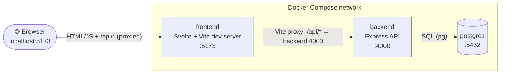
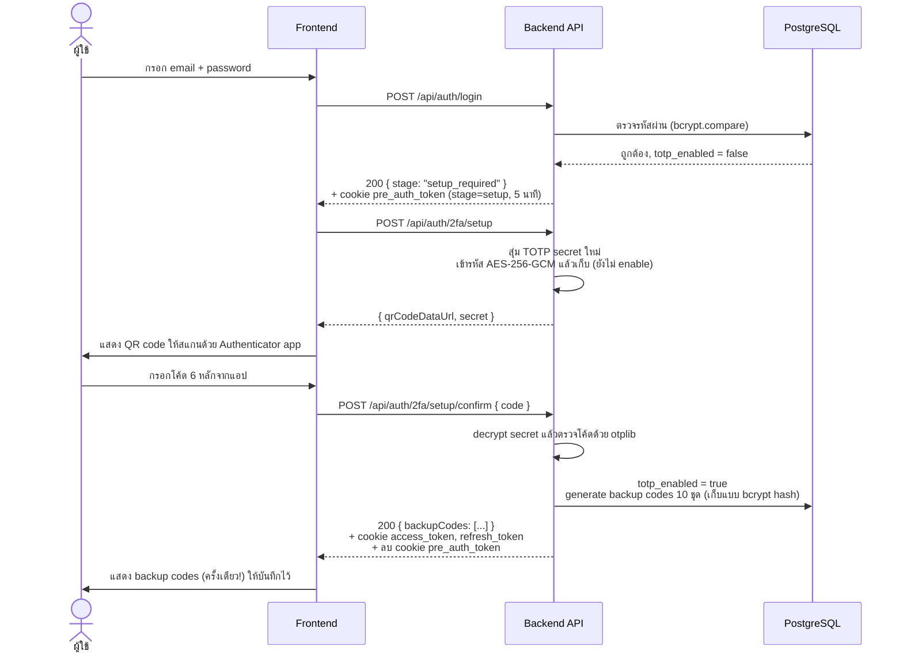
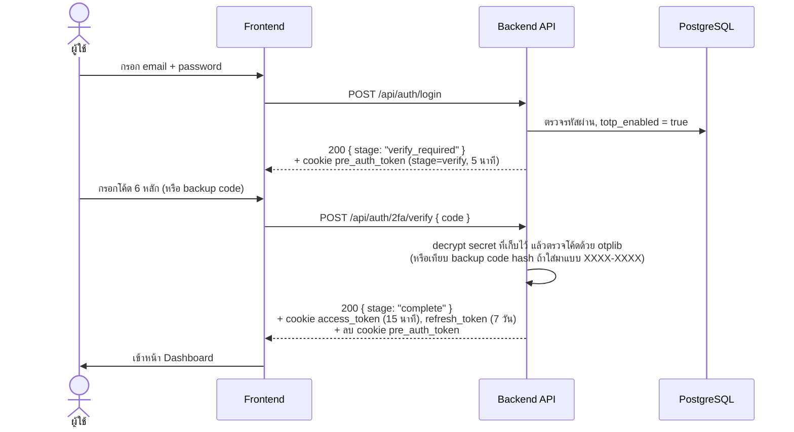
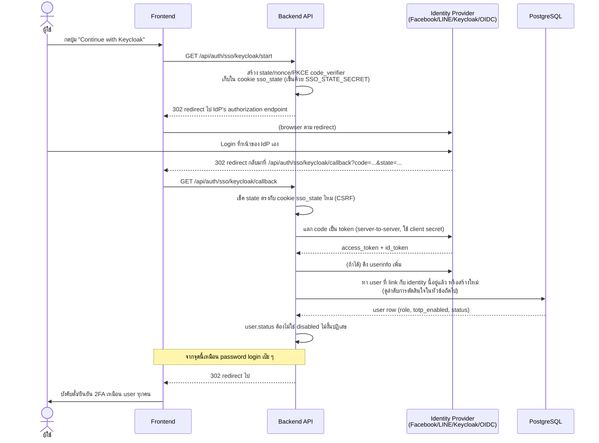

# 🔐 2FA Example — Login + RBAC + บังคับ 2FA (TOTP) + SSO (OIDC/Facebook/LINE/Keycloak)

โปรเจกต์ตัวอย่างสำหรับ **เรียนรู้การสร้างระบบ Login ที่บังคับ 2FA กับผู้ใช้ทุกคน** พร้อมระบบ
**RBAC (Role-Based Access Control)**, หน้าบริหารจัดการผู้ใช้, และ **Single Sign-On (SSO)** ผ่าน
Facebook / LINE / Keycloak / OpenID Connect ทั่วไป — เขียนขึ้นเพื่อให้อ่านโค้ดแล้วเข้าใจ "วิธีทำงานจริง"
ของ TOTP 2FA, JWT session, OAuth2/OIDC, การเข้ารหัส/hash ข้อมูลลับ และ RBAC ไม่ใช่แค่เอาไปรันอย่างเดียว

> ⚠️ **นี่คือโปรเจกต์เพื่อการศึกษา** ไม่ควรนำขึ้น production ตรง ๆ โดยไม่ผ่านการรีวิวความปลอดภัยเพิ่มเติม
> (ดูหัวข้อ [ข้อจำกัดที่ตั้งใจไว้](#-ข้อจำกัดที่ตั้งใจไว้))

## สารบัญ

- [เทคโนโลยีที่ใช้](#-เทคโนโลยีที่ใช้)
- [สถาปัตยกรรมระบบ](#-สถาปัตยกรรมระบบ)
- [เริ่มใช้งาน (Quick Start)](#-เริ่มใช้งาน-quick-start)
- [ขั้นตอนการทำงานของ 2FA](#-ขั้นตอนการทำงานของ-2fa) — หัวใจของโปรเจกต์นี้
- [SSO / OIDC (Facebook, LINE, Keycloak)](#-sso--oidc-facebook-line-keycloak)
- [RBAC ทำงานอย่างไร](#-rbac-ทำงานอย่างไร)
- [ความลับถูกเก็บอย่างไร: hash vs encrypt](#-ความลับถูกเก็บอย่างไร-hash-vs-encrypt)
- [Session & Token](#-session--token)
- [โครงสร้างโปรเจกต์](#-โครงสร้างโปรเจกต์)
- [ตัวแปรแวดล้อม (Environment Variables)](#-ตัวแปรแวดล้อม-environment-variables)
- [API Reference](#-api-reference)
- [ความปลอดภัย: สแกนและ CI/CD](#-ความปลอดภัย-สแกนและ-cicd)
- [ข้อจำกัดที่ตั้งใจไว้](#-ข้อจำกัดที่ตั้งใจไว้)
- [แนวทางต่อยอด](#-แนวทางต่อยอด)
- [Credits](#-credits)

## 🛠 เทคโนโลยีที่ใช้

| ส่วน | เทคโนโลยี |
|---|---|
| Frontend | [Svelte 4](https://svelte.dev) + [Vite](https://vitejs.dev) + [svelte-spa-router](https://github.com/ItalyPaleAle/svelte-spa-router) |
| Backend | [Node.js 20](https://nodejs.org) + [Express](https://expressjs.com) |
| Database | [PostgreSQL 16](https://www.postgresql.org) (ผ่าน `pg` driver, raw SQL — ไม่ใช้ ORM เพื่อให้เห็น query ตรง ๆ) |
| 2FA | [otplib](https://github.com/yeojz/otplib) (TOTP) + [qrcode](https://github.com/soldair/node-qrcode) |
| SSO / OIDC | [openid-client](https://github.com/panva/openid-client) v6 (Keycloak/LINE/generic OIDC) + Facebook OAuth2 เขียนมือ |
| Auth | [jsonwebtoken](https://github.com/auth0/node-jsonwebtoken) (JWT ใน httpOnly cookie), [bcryptjs](https://github.com/dcodeIO/bcrypt.js) |
| Identity Provider (optional) | [Keycloak](https://www.keycloak.org) — รันเป็น addon container ผ่าน `docker-compose.keycloak.yml` |
| Infra | Docker + Docker Compose, GitHub Actions (CI/CD) |

## 🏗 สถาปัตยกรรมระบบ



Browser คุยกับ origin เดียวคือ `localhost:5173` เท่านั้น — Vite dev server proxy คำขอที่ขึ้นต้นด้วย
`/api` ไปยัง container `backend` ให้เอง (ดู [frontend/vite.config.js](frontend/vite.config.js))
ทำให้ cookie ที่ backend เซ็ตเป็น **same-origin เสมอ** ไม่ต้องยุ่งกับ CORS/`SameSite=None` ที่ซับซ้อน
ซึ่งเป็นกับดักที่คนเขียนระบบ auth แบบ SPA + API แยกกันมักเจอ

**docker-compose มี 2 แบบ** เลือกได้ตามต้องการ:

| แบบ | คำสั่ง | เหมาะกับ |
|---|---|---|
| ไม่มี Keycloak (ค่าเริ่มต้น) | `docker compose up -d --build` | เรียน 2FA/RBAC ล้วน ๆ, ใช้ Facebook/LINE/OIDC ของจริงถ้าตั้งค่า |
| มี Keycloak ในตัว | `docker compose -f docker-compose.yml -f docker-compose.keycloak.yml up -d --build` | อยากลองทั้ง flow SSO แบบ end-to-end ทันทีโดยไม่ต้องไปสมัคร provider ข้างนอกเลย (Keycloak import realm ให้พร้อมใช้ พร้อม demo user) |

`docker-compose.keycloak.yml` เป็น **addon file** เพิ่ม service `keycloak` เข้าไปและ override
environment ของ `backend` ให้ชี้ไปที่มัน — ไม่ได้แทนที่ `docker-compose.yml` ต้องส่ง `-f` สองไฟล์เสมอ
เวลารันแบบมี Keycloak (รวมถึงตอน `down` ด้วย)

## 🚀 เริ่มใช้งาน (Quick Start)

### สิ่งที่ต้องมี

- [Docker](https://www.docker.com/) และ Docker Compose (มาพร้อม Docker Desktop)
- [OpenSSL](https://www.openssl.org/) (มีอยู่แล้วใน macOS/Linux, บน Windows ใช้ Git Bash ก็มี) สำหรับ generate secret

### ขั้นตอน

**1. สร้างไฟล์ .env พร้อม secret สุ่มให้อัตโนมัติ**

```bash
bash scripts/generate-secrets.sh
```

สคริปต์นี้ copy `.env.example` → `.env` ทั้ง 3 ที่ (root, `backend/`, `frontend/`) แล้ว generate
`ACCESS_TOKEN_SECRET` / `REFRESH_TOKEN_SECRET` / `PRE_AUTH_TOKEN_SECRET` / `SSO_STATE_SECRET` /
`TOTP_ENCRYPTION_KEY` ให้อัตโนมัติด้วย `openssl rand` (รันซ้ำได้ ไม่ทับไฟล์ที่มีอยู่แล้ว) ไม่อยากใช้
สคริปต์ก็ `cp` ไฟล์ `.env.example` แต่ละที่เองแล้ว generate ด้วย `openssl rand -hex 64`
(3 ตัว token secret) กับ `openssl rand -hex 32` (`TOTP_ENCRYPTION_KEY`) ก็ได้เหมือนกัน

**2. แก้รหัสผ่านฐานข้อมูลและ admin เริ่มต้น (แนะนำ)**

เปิด `.env` (root) แก้ `POSTGRES_PASSWORD`, และเปิด `backend/.env` แก้ `ADMIN_EMAIL` / `ADMIN_PASSWORD`
ให้เป็นค่าของคุณเอง (ต้อง sync `POSTGRES_PASSWORD` ให้ตรงกันทั้ง root `.env` เท่านั้น — ดู
[docker-compose.yml](docker-compose.yml) ที่ forward ค่านี้เข้า backend container ให้อัตโนมัติแล้ว)

**3. Build และรัน**

```bash
docker compose up -d --build
```

หรือถ้าอยากลอง SSO ผ่าน Keycloak ทันทีโดยไม่ต้องสมัคร provider ข้างนอกเลย ใช้คำสั่งนี้แทน (ดูรายละเอียด
ที่หัวข้อ [SSO / OIDC](#-sso--oidc-facebook-line-keycloak)):

```bash
docker compose -f docker-compose.yml -f docker-compose.keycloak.yml up -d --build
```

รอสักครู่ — backend จะรัน database migration และสร้างบัญชี admin เริ่มต้นให้อัตโนมัติตอน start
(ดู log ด้วย `docker compose logs -f backend`)

**4. เปิดเว็บ**

เปิด [http://localhost:5173](http://localhost:5173) — มีบัญชีให้ทดสอบพร้อมทั้ง 2 สิทธิ์ตั้งแต่ครั้งแรก
ที่ start (seed ให้อัตโนมัติ ค่าเริ่มต้นมาจาก `backend/.env`):

| สิทธิ์ | Email | รหัสผ่าน | หมายเหตุ |
|---|---|---|---|
| `admin` | `ADMIN_EMAIL` (default `admin@example.com`) | `ADMIN_PASSWORD` (default `change_me_immediately!1`) | ถูกบังคับเปลี่ยนรหัสผ่าน + ตั้ง 2FA ทันทีตั้งแต่ login ครั้งแรก |
| `user` | `TEST_USER_EMAIL` (default `user@example.com`) | `TEST_USER_PASSWORD` (default `UserTest123`) | ไม่บังคับเปลี่ยนรหัสผ่าน แต่ยังต้องตั้ง 2FA เหมือนกันทุกบัญชี ใช้ทดสอบว่าเมนู/endpoint ที่ admin เท่านั้นเข้าได้ ถูกซ่อน/ปฏิเสธจริงสำหรับ role นี้ |

ทั้ง 2 บัญชีต้องผ่าน 2FA setup บังคับก่อนถึงจะเข้าใช้งานได้ (ไม่มีทางลัด แม้เป็นบัญชีทดสอบ) — login ด้วย
รหัสผ่านที่ตั้งไว้ ระบบจะบังคับให้ตั้ง 2FA และ (เฉพาะ `admin`) เปลี่ยนรหัสผ่านทันทีตั้งแต่ครั้งแรกที่ login

> ⚠️ บัญชี `TEST_USER_*` มีไว้เพื่อความสะดวกในการทดสอบ/สาธิต RBAC เท่านั้น **ลบหรือเปลี่ยนรหัสผ่านก่อนนำไป
> deploy จริงเสมอ**

### คำสั่งอื่น ๆ ที่มีประโยชน์

```bash
docker compose logs -f backend    # ดู log ของ API
docker compose down               # หยุดทุก service (เก็บข้อมูลใน DB ไว้)
docker compose down -v            # หยุด + ล้างฐานข้อมูลทั้งหมด (รอบต่อไปจะ seed admin/test user ใหม่)
bash scripts/smoke-test.sh        # ทดสอบ flow หลักทั้งหมดแบบอัตโนมัติ (ต้องมีสแตกรันอยู่ก่อน)
```

> ถ้ารันแบบมี Keycloak ต้องใส่ `-f docker-compose.yml -f docker-compose.keycloak.yml` ทุกคำสั่ง
> `docker compose` เหมือนกันตอน `up`, ไม่ใช่แค่ตอนแรก

## 🔑 ขั้นตอนการทำงานของ 2FA

นี่คือส่วนสำคัญที่สุดของโปรเจกต์นี้ ถ้าเข้าใจ flow นี้ก็เข้าใจหัวใจของระบบทั้งหมด

**หลักการ:** การ login ด้วย email + password อย่างเดียว **ไม่มีทางทำให้ได้ session ที่ใช้เรียก API
อื่นได้เลย** ไม่ว่า role ไหนก็ตาม — รหัสผ่านที่ถูกต้องจะได้แค่ **"pre-auth token"** อายุสั้น (5 นาที)
ที่พาไปต่อยอดกับ 2FA เท่านั้น ไม่สามารถใช้เรียก endpoint อื่นที่ต้อง login ได้

### กรณีที่ 1: ผู้ใช้ยังไม่เคยตั้ง 2FA (บังคับตั้งใหม่)



### กรณีที่ 2: ผู้ใช้ตั้ง 2FA ไว้แล้ว (login ปกติ)



### สิ่งที่ทำให้ 2FA เป็น "บังคับจริง" ไม่ใช่แค่ตัวเลือก

1. **ไม่มี branch ไหนใน `login` controller ที่ออก session เต็มได้เลย** — ดูโค้ดจริงที่
   [backend/src/controllers/auth.controller.js](backend/src/controllers/auth.controller.js) ฟังก์ชัน
   `login` จะเห็นว่าทุก path (ไม่ว่า `totp_enabled` จะเป็น true หรือ false) จบด้วยการออก
   pre-auth token เท่านั้น ไม่มี `issueFullSession()` ปนอยู่เลย
2. **Admin ปิด 2FA ให้ user ไม่ได้** มีแต่ "reset" (`POST /api/admin/users/:id/reset-2fa`) ซึ่งแค่ล้าง
   secret เดิมทิ้ง — ผลคือ user คนนั้น login ครั้งหน้าจะตกไปกรณีที่ 1 (บังคับตั้งใหม่) ทันที ไม่ใช่ทางลัด
   ให้ข้าม 2FA แต่อย่างใด
3. **pre-auth token เซ็นด้วย secret คนละตัว** (`PRE_AUTH_TOKEN_SECRET`) จาก access token
   (`ACCESS_TOKEN_SECRET`) — แม้โค้ดจะมี bug ที่ไหนสักที่ที่ดันเอา pre-auth token ไปเข้า middleware
   ตรวจ access token ก็ verify ไม่ผ่านอยู่ดี เพราะ secret ไม่ตรงกัน

### Backup codes

ตอนตั้ง 2FA สำเร็จ (หรือกด "regenerate" ในหน้า Profile) ระบบจะสุ่ม backup code 10 ชุด รูปแบบ
`XXXX-XXXX` แสดงให้ผู้ใช้เห็น **ครั้งเดียว** แล้วเก็บแค่ bcrypt hash ไว้ในตาราง `backup_codes` — ใช้แทน
โค้ด TOTP ได้ตอน verify (ระบบเดา format จาก `XXXX-XXXX` เทียบกับ 6 หลักตัวเลข) แต่ละโค้ดใช้ได้ครั้งเดียว
แล้วจะถูก mark `used_at` ทันที

## 🔗 SSO / OIDC (Facebook, LINE, Keycloak)

นอกจาก login ด้วย email/password แล้ว ระบบรองรับ **Single Sign-On** ผ่าน:

- **Facebook Login** (OAuth 2.0)
- **LINE Login** (OpenID Connect)
- **Keycloak** (OpenID Connect — self-hosted identity provider)
- **OIDC ทั่วไป** (generic — ใช้ล็อกอินผ่าน IdP อื่นที่ compliant กับ OpenID Connect ได้ เช่น Google,
  Auth0, Okta, Azure AD, หรือ Keycloak realm อื่น)

ทุกตัวเป็น **optional** ปิดอยู่โดย default เปิดผ่าน `.env` ทีละตัว — ปุ่ม SSO บนหน้า login จะโผล่มาเฉพาะ
provider ที่เปิดไว้จริง (frontend เรียก `GET /api/auth/sso/providers` มาดูว่าเปิดตัวไหนบ้าง)

### หลักการที่สำคัญที่สุด: SSO ไม่ได้ยกเว้น 2FA

**Login ผ่าน SSO สำเร็จ ≠ ได้ session ใช้เรียก API ได้ทันที** — เหมือนกับ password login เป๊ะ ๆ
IdP ภายนอกแค่บอกว่า "คนนี้คือใคร" แต่ระบบจะยังพา user คนนั้นไปเข้า flow บังคับตั้ง/ยืนยัน 2FA (ตาม
[ขั้นตอนการทำงานของ 2FA](#-ขั้นตอนการทำงานของ-2fa) ด้านบน) เหมือน user ทุกคนไม่มีข้อยกเว้น — เพราะ
callback ของ SSO เรียกฟังก์ชันออก **pre-auth token ตัวเดียวกัน** กับที่ password login เรียก ไม่มี
code path พิเศษที่ข้ามไปออก session เต็มได้เลย



### ระบบจับคู่ external identity กับ user ในระบบ

ตอน login สำเร็จจาก IdP ระบบต้องตัดสินใจว่า "นี่คือ user คนไหนในระบบเรา" ตามลำดับนี้ (ดูโค้ดจริงที่
[backend/src/services/sso.service.js](backend/src/services/sso.service.js) ฟังก์ชัน
`findOrCreateUserFromIdentity`):

1. เคย login ด้วย identity นี้มาก่อนแล้ว (มี row ใน `oauth_identities` ตรงกับ provider + provider user id)
   → ใช้ user เดิม
2. Email ที่ IdP ส่งมา **verified แล้ว** และตรงกับ user ที่มีอยู่ในระบบ (เช่น admin สร้างไว้ก่อน) → link
   identity เข้ากับ user เดิม (ไม่สร้างซ้ำ) — **ทำเฉพาะ email ที่ verified เท่านั้น** ถ้า IdP บอกว่า
   email ยังไม่ verified จะไม่ auto-link ให้ เพราะอาจเป็นคนละคนที่ดันใส่ email เดียวกันแต่ไม่ได้เป็น
   เจ้าของจริง (กัน account takeover)
3. ไม่มี user ให้ link เลย → สร้างใหม่ ให้ role `user` และ **ไม่มีรหัสผ่าน local** (`password_hash =
   NULL`) เพราะยังไม่เคยตั้งไว้ — ยังต้องผ่าน 2FA บังคับเหมือน user ทุกคนก่อนเข้าใช้งานได้

Account ที่มาจาก SSO อย่างเดียว (ไม่มีรหัสผ่าน local) จะไม่เห็นลิงก์ "เปลี่ยนรหัสผ่าน" ในหน้า Profile —
แต่ admin ยังสามารถกด "Reset password" ให้ในหน้า Admin Users ได้ตามปกติ (ทำให้ account นั้นมีรหัสผ่าน
local เพิ่มขึ้นมา ใช้ login ได้ทั้ง 2 ทาง)

### วิธีเปิดใช้งานแต่ละ provider

ทุก redirect URI ที่ต้องลงทะเบียนกับ provider คือ `http://localhost:5173/api/auth/sso/<provider>/callback`
(เปลี่ยน `<provider>` เป็น `facebook` / `line` / `keycloak` / `oidc`)

<details>
<summary><strong>Facebook Login</strong></summary>

1. สร้างแอปที่ [Facebook for Developers](https://developers.facebook.com/) → เพิ่ม product
   "Facebook Login" → เลือก "Web"
2. ใน Facebook Login settings ใส่ **Valid OAuth Redirect URI**:
   `http://localhost:5173/api/auth/sso/facebook/callback`
3. คัดลอก App ID / App Secret มาใส่ `backend/.env`:
   ```
   FACEBOOK_ENABLED=true
   FACEBOOK_CLIENT_ID=<App ID>
   FACEBOOK_CLIENT_SECRET=<App Secret>
   ```
4. `docker compose up -d --build` ใหม่ (หรือรอ nodemon restart เอง)

</details>

<details>
<summary><strong>LINE Login</strong></summary>

1. สร้าง channel ที่ [LINE Developers Console](https://developers.line.biz/console/) เลือกประเภท
   "LINE Login"
2. เปิด "OpenID Connect" ใน channel settings แล้วเพิ่ม **Callback URL**:
   `http://localhost:5173/api/auth/sso/line/callback`
3. คัดลอก Channel ID / Channel secret มาใส่ `backend/.env`:
   ```
   LINE_ENABLED=true
   LINE_CLIENT_ID=<Channel ID>
   LINE_CLIENT_SECRET=<Channel secret>
   ```
4. Email จาก LINE ต้องขอสิทธิ์ "email permission" แยกจาก LINE เป็นรายกรณี (อนุมัติมือ) — ถ้าไม่ได้ขอ/
   ยังไม่ได้รับอนุมัติ ระบบจะ fallback ไปสร้าง account ด้วย placeholder email อัตโนมัติ ใช้งานได้ปกติ
   ไม่ error

</details>

<details>
<summary><strong>OpenID Connect ทั่วไป (Google, Auth0, Okta, ...)</strong></summary>

ใช้ config ชุด `OIDC_*` สำหรับ IdP ตัวใดก็ได้ที่มี OpenID Connect Discovery document
(`/.well-known/openid-configuration`) — ตัวอย่างกับ Google:

```
OIDC_ENABLED=true
OIDC_DISPLAY_NAME=Google
OIDC_ISSUER_URL=https://accounts.google.com
OIDC_CLIENT_ID=<client id จาก Google Cloud Console>
OIDC_CLIENT_SECRET=<client secret>
```

Redirect URI ที่ต้องลงทะเบียนกับ provider: `http://localhost:5173/api/auth/sso/oidc/callback`

</details>

<details>
<summary><strong>Keycloak (self-hosted)</strong></summary>

มี 2 ทางเลือก:

**ทางเลือกที่ 1 — ใช้ตัวที่มาพร้อม repo (แนะนำสำหรับลองเล่น/เรียนรู้)**

```bash
docker compose -f docker-compose.yml -f docker-compose.keycloak.yml up -d --build
```

คำสั่งนี้จะรัน Keycloak ให้พร้อม import realm `twofa-example` ที่มี client (`twofa-backend`) และ
redirect URI ลงทะเบียนไว้ให้แล้วจาก [keycloak/realm-export.json](keycloak/realm-export.json) — ไม่ต้อง
ไปตั้งค่าอะไรในหน้า Keycloak admin console เลย พร้อม demo user ให้ทดสอบทันที:
**demo@example.com / DemoPass123**

เปิด [http://localhost:8080](http://localhost:8080) ด้วย admin console (`admin`/`admin` ตาม default
ใน `docker-compose.keycloak.yml` — เปลี่ยนได้ผ่าน `KEYCLOAK_ADMIN_USER`/`KEYCLOAK_ADMIN_PASSWORD` ใน
root `.env`) ถ้าอยากดู/แก้ config ของ realm

> ⚠️ Client secret ที่ใช้ (`twofa-backend-secret-change-me`) ถูก commit ไว้ใน git ตรง ๆ — ยอมรับได้
> เฉพาะเพราะ Keycloak instance นี้เป็น sandbox ในเครื่องตัวเองเท่านั้น **ห้ามเอา pattern นี้ไปใช้กับ
> Keycloak ที่มีผู้ใช้จริงเด็ดขาด**

**ทางเลือกที่ 2 — ต่อกับ Keycloak ของตัวเอง (ที่มีอยู่แล้ว/deploy เอง)**

```
KEYCLOAK_ENABLED=true
KEYCLOAK_ISSUER_URL=https://your-keycloak.example.com/realms/your-realm
KEYCLOAK_CLIENT_ID=<client id>
KEYCLOAK_CLIENT_SECRET=<client secret>
```

ถ้า Keycloak รันในเครือข่าย docker เดียวกันแต่ browser เข้าถึงด้วย host คนละตัวกับที่ backend เข้าถึง
(เช่นสถานการณ์เดียวกับ addon ในทางเลือกที่ 1) ต้องตั้ง `KEYCLOAK_PUBLIC_ISSUER_URL` ด้วย — ดูคำอธิบาย
เต็มเรื่อง internal vs public URL ใน [CLAUDE.md](CLAUDE.md#sso--oidc-facebook-line-keycloak-generic-oidc)

</details>

## 🛂 RBAC ทำงานอย่างไร

มี 3 role: `admin`, `manager`, `user` — permission ทั้งหมดกำหนดจากที่เดียวใน
[backend/src/config/permissions.js](backend/src/config/permissions.js):

```js
export const PERMISSIONS = {
  'users:read':  ['admin', 'manager'],  // manager ดูรายชื่อ user ได้ แก้ไขไม่ได้
  'users:write': ['admin'],             // สร้าง/แก้ role/reset ต่าง ๆ — admin เท่านั้น
  'audit:read':  ['admin'],             // ดู audit log — admin เท่านั้น
};
```

Middleware `requirePermission('users:write')` เช็ค `req.user.role` กับ map นี้ก่อนเข้าตัว controller
ทุกครั้ง (ดู [backend/src/middleware/rbac.middleware.js](backend/src/middleware/rbac.middleware.js))
เพิ่ม role หรือ permission ใหม่ แก้ที่ไฟล์เดียวนี้พอ ไม่ต้องไล่แก้ทุก route

ตัวอย่างการปฏิเสธจริง: `user` role เรียก `GET /api/admin/users` จะได้ `403 Forbidden` ทันที แม้จะมี
access token ที่ valid อยู่ก็ตาม เพราะการ login สำเร็จ ≠ มีสิทธิ์ทำทุกอย่าง

## 🔒 ความลับถูกเก็บอย่างไร: hash vs encrypt

ข้อกำหนดของโปรเจกต์นี้คือ **credential ทุกตัวเก็บในไฟล์ `.env`** (ไม่ hardcode ในโค้ด) และ
**secret ที่เก็บในฐานข้อมูลต้องไม่เก็บเป็นข้อความล้วน (plaintext)** — แต่ "hash" กับ "encrypt" ใช้ต่างกัน
คนละกรณี ตามตารางนี้:

| ข้อมูล | เก็บด้วย | ทำไม |
|---|---|---|
| รหัสผ่านผู้ใช้ | **bcrypt hash** (one-way) | ระบบไม่จำเป็นต้องรู้รหัสผ่านจริงเลย แค่เทียบว่า hash ตรงกันไหมตอน login |
| Backup codes | **bcrypt hash** (one-way) | เป็น secret สุ่มที่ใช้ครั้งเดียวทิ้ง เหมือนรหัสผ่าน — ไม่ต้องเอาค่าจริงมาโชว์ซ้ำอีก |
| TOTP secret | **AES-256-GCM encrypt** (two-way) | ระบบ**ต้อง**ถอดกลับเป็นค่าจริงได้ทุกครั้งที่ผู้ใช้ login เพื่อคำนวณโค้ด TOTP ที่คาดหวัง ณ เวลานั้น จะ hash แบบ one-way ไม่ได้เลยเพราะไม่มีทางย้อนกลับ |
| Refresh token | **SHA-256 hash** | ตัว token เองสุ่มจาก JWT ที่ entropy สูงมากอยู่แล้ว (ไม่ใช่คำที่คนจำได้แบบรหัสผ่าน) ไม่จำเป็นต้องใช้ bcrypt ที่ตั้งใจให้คำนวณช้าเพื่อกันเดา — SHA-256 พอสำหรับเทียบว่า token ที่ส่งมาตรงกับที่ DB เก็บไว้ |

จุดที่มักเข้าใจผิด: **TOTP secret เข้ารหัส ไม่ได้ hash** เพราะการ hash เป็น one-way (ทำแล้วย้อนกลับไม่ได้)
แต่ TOTP ต้องเอา secret ตัวจริงไปคำนวณ HMAC-SHA1 ทุกครั้งที่ตรวจโค้ด ถ้า hash secret ไว้ ระบบจะไม่มีวัน
ตรวจโค้ดจากแอปผู้ใช้ได้อีกเลย จึงต้องใช้ **AES-256-GCM** (symmetric encryption ที่ถอดกลับได้ด้วย key
ที่เก็บใน `.env` — `TOTP_ENCRYPTION_KEY`) แทน

## 🍪 Session & Token

| Cookie | อายุ | Secret (env var) |
|---|---|---|
| `pre_auth_token` | 5 นาที | `PRE_AUTH_TOKEN_SECRET` |
| `access_token` | 15 นาที | `ACCESS_TOKEN_SECRET` |
| `refresh_token` | 7 วัน | `REFRESH_TOKEN_SECRET` |
| `sso_state` | 10 นาที | `SSO_STATE_SECRET` (CSRF state + OIDC nonce + PKCE ระหว่าง redirect ไป-กลับ IdP เท่านั้น) |

ทั้งหมดเป็น **httpOnly cookie** (JavaScript ฝั่ง browser อ่านไม่ได้ กัน XSS ขโมย token ไปใช้)
`SameSite=Lax` และ `Secure` เปิด/ปิดตาม `COOKIE_SECURE` ใน `.env` (เปิดเมื่อรันผ่าน HTTPS จริง)

`refresh_token` ถูก **rotate ทุกครั้งที่ใช้**: เรียก `POST /api/auth/refresh` แต่ละครั้ง token เก่าจะถูก
revoke (mark ในตาราง `refresh_tokens`) แล้วออกตัวใหม่ทันที ถ้ามีใครเอา refresh token ที่ revoke ไปแล้ว
มาใช้ซ้ำ (สัญญาณว่าโดนขโมย token ไปแล้วมีคนใช้คนละที่กัน) ระบบจะ revoke session **ทั้งหมด** ของ user
คนนั้นทันที เพื่อบังคับให้ login ใหม่

## 📁 โครงสร้างโปรเจกต์

```
2FA-example-coding/
├── docker-compose.yml
├── docker-compose.keycloak.yml  # addon: เพิ่ม Keycloak + ชี้ backend ไปที่มัน (รันคู่กับไฟล์บนเสมอ)
├── keycloak/realm-export.json   # realm/client/demo user ที่ Keycloak import ให้อัตโนมัติ
├── .env.example                 # ตัวแปรระดับ infra (DB credential, ports)
├── scripts/
│   ├── generate-secrets.sh      # สร้าง .env ทั้งหมด + generate secret ให้อัตโนมัติ
│   └── smoke-test.sh            # ทดสอบ flow หลักทั้งหมดแบบ end-to-end (ใช้ใน CI ด้วย)
├── .github/workflows/           # ci.yml (audit+scan+build+trivy+smoke test ทุก PR), cd.yml (publish image ตอน tag)
├── CI-CD.md
├── CREDIT.md                    # รายชื่อ open-source software/บริการที่ใช้ในโปรเจกต์
├── backend/
│   ├── Dockerfile
│   ├── .env.example            # JWT secret, TOTP key, admin/test user bootstrap, SSO provider config ฯลฯ
│   └── src/
│       ├── config/              env.js (validate ด้วย zod), db.js, permissions.js, identityProviders.js (SSO)
│       ├── db/                  migrations/ (001_init, 002_add_sso), migrate.js, seed.js
│       ├── middleware/          auth, rbac, rateLimit, error
│       ├── validators/          zod schema ของทุก request
│       ├── services/            business logic (user/token/twofa/audit/oidcClient/facebook/sso)
│       ├── controllers/         auth, admin, sso controller
│       └── routes/
└── frontend/
    ├── Dockerfile
    ├── .env.example
    ├── .trivyignore             # CVE ที่ตรวจแล้วไม่มี code path ให้ exploit ได้จริงในการรันแบบนี้
    └── src/
        ├── lib/                 api.js, guards.js, stores/
        ├── pages/                1 ไฟล์ต่อ 1 หน้า (Login, Setup2FA, Verify2FA, AdminUsers, ...)
        ├── components/Navbar.svelte
        └── App.svelte            route table
```

รายละเอียดเชิงลึกกว่านี้ (การตัดสินใจออกแบบ, เหตุผลของแต่ละจุด) อยู่ใน [CLAUDE.md](CLAUDE.md), กระบวนการ
CI/CD อยู่ใน [CI-CD.md](CI-CD.md)

## ⚙️ ตัวแปรแวดล้อม (Environment Variables)

### Root `.env` (ใช้โดย docker-compose สำหรับ PostgreSQL)

| ตัวแปร | คำอธิบาย |
|---|---|
| `POSTGRES_USER`, `POSTGRES_PASSWORD`, `POSTGRES_DB` | Credential ของฐานข้อมูล — ถูก forward เข้า backend container ให้อัตโนมัติ |
| `POSTGRES_PORT`, `BACKEND_PORT`, `FRONTEND_PORT` | Port บนเครื่อง host ที่ map เข้า container |

### `backend/.env`

| ตัวแปร | คำอธิบาย |
|---|---|
| `ACCESS_TOKEN_SECRET` / `REFRESH_TOKEN_SECRET` / `PRE_AUTH_TOKEN_SECRET` / `SSO_STATE_SECRET` | ต้องเป็นค่าสุ่มยาว ๆ คนละค่ากันทั้ง 4 ตัว (`openssl rand -hex 64`) — หรือรัน `scripts/generate-secrets.sh` ให้ทำให้อัตโนมัติ |
| `TOTP_ENCRYPTION_KEY` | 64 hex chars (`openssl rand -hex 32`) ใช้เข้ารหัส TOTP secret ในฐานข้อมูล |
| `ACCESS_TOKEN_TTL` / `REFRESH_TOKEN_TTL` / `PRE_AUTH_TOKEN_TTL` | อายุ token แต่ละประเภท (ค่า default: `15m` / `7d` / `5m`) |
| `TRUST_PROXY` | ปล่อยเป็น `false` ไว้ ถ้าไม่มี reverse proxy จริงอยู่หน้า backend (ค่า default ปลอดภัยกว่า) |
| `COOKIE_SECURE` | ตั้ง `true` เฉพาะตอนรันผ่าน HTTPS จริง |
| `LOGIN_MAX_ATTEMPTS` / `LOGIN_LOCK_MINUTES` | นโยบาย account lockout |
| `ADMIN_EMAIL` / `ADMIN_PASSWORD` / `ADMIN_FULL_NAME` | บัญชี admin ที่ seed ให้อัตโนมัติตอน start ครั้งแรก (ถูกบังคับเปลี่ยนรหัสผ่าน + ตั้ง 2FA ทันทีที่ login ครั้งแรก) |
| `TEST_USER_EMAIL` / `TEST_USER_PASSWORD` / `TEST_USER_FULL_NAME` | บัญชี role `user` ที่ seed ให้อัตโนมัติเช่นกัน (มี default ในตัว ไม่บังคับตั้งเหมือน `ADMIN_*`) สำหรับทดสอบ RBAC ฝั่ง user ธรรมดาโดยไม่ต้องสร้างมือ — ลบ/เปลี่ยนก่อน deploy จริง |
| `FACEBOOK_ENABLED` / `FACEBOOK_CLIENT_ID` / `FACEBOOK_CLIENT_SECRET` | เปิด Facebook Login (ดูวิธีขอมาที่หัวข้อ [SSO / OIDC](#-sso--oidc-facebook-line-keycloak)) |
| `LINE_ENABLED` / `LINE_CLIENT_ID` / `LINE_CLIENT_SECRET` | เปิด LINE Login |
| `KEYCLOAK_ENABLED` / `KEYCLOAK_ISSUER_URL` / `KEYCLOAK_CLIENT_ID` / `KEYCLOAK_CLIENT_SECRET` | เปิด Keycloak (มี `KEYCLOAK_PUBLIC_ISSUER_URL`/`KEYCLOAK_ALLOW_INSECURE` เพิ่มเติมสำหรับ setup แบบ docker-compose ในเครื่อง) |
| `OIDC_ENABLED` / `OIDC_DISPLAY_NAME` / `OIDC_ISSUER_URL` / `OIDC_CLIENT_ID` / `OIDC_CLIENT_SECRET` | เปิด generic OIDC provider ใด ๆ (Google, Auth0, Okta, ...) |

ทุกตัวแปร SSO เป็น optional และปิดโดย default (`*_ENABLED=false`) — ถ้าเปิดไว้แต่ config ไม่ครบ backend
จะ log warning แล้ว disable provider นั้นให้เอง ไม่ทำให้ทั้ง app boot ไม่ขึ้น

### `frontend/.env`

| ตัวแปร | คำอธิบาย |
|---|---|
| `VITE_API_BASE_URL` | ปกติใช้ `/api` (ให้ Vite proxy จัดการต่อ ไม่ต้องรู้จัก backend host ตรง ๆ) |

ดูค่า default และคำอธิบายเต็มในตัวไฟล์ `.env.example` ของแต่ละที่

## 📡 API Reference

### Auth (`/api/auth`)

| Method | Path | ต้อง login? | คำอธิบาย |
|---|---|---|---|
| POST | `/login` | ❌ | ตรวจ email/password → คืน stage `setup_required` หรือ `verify_required` เท่านั้น |
| POST | `/2fa/setup` | pre-auth (stage `setup`) | สุ่ม TOTP secret ใหม่ คืน QR code + secret |
| POST | `/2fa/setup/confirm` | pre-auth (stage `setup`) | ยืนยันโค้ดแรก → enable 2FA + ออก session + คืน backup codes |
| POST | `/2fa/verify` | pre-auth (stage `verify`) | ตรวจโค้ด TOTP/backup code → ออก session |
| POST | `/refresh` | refresh cookie | ขอ access token ใหม่ (rotate refresh token) |
| POST | `/logout` | ✅ | revoke refresh token, ลบ cookie ทั้งหมด |
| GET | `/me` | ✅ | ข้อมูลผู้ใช้ปัจจุบัน |
| POST | `/change-password` | ✅ | เปลี่ยนรหัสผ่าน (ต้องยืนยันรหัสเดิม) |
| POST | `/2fa/backup-codes/regenerate` | ✅ | สร้าง backup codes ชุดใหม่ (ชุดเดิมใช้ไม่ได้อีก) |

### SSO (`/api/auth/sso`)

| Method | Path | ต้อง login? | คำอธิบาย |
|---|---|---|---|
| GET | `/providers` | ❌ | รายชื่อ provider ที่เปิดไว้ (สำหรับวาดปุ่มบนหน้า login) |
| GET | `/:provider/start` | ❌ | Redirect ไปหน้า login ของ provider นั้น (`:provider` = `facebook`/`line`/`keycloak`/`oidc`) |
| GET | `/:provider/callback` | ❌ (แต่ต้องมี cookie `sso_state` ที่ถูกต้อง) | Provider redirect กลับมาที่นี่ → สำเร็จแล้ว redirect ต่อไปหน้า 2FA setup/verify เหมือน password login |

### Admin (`/api/admin`) — ต้อง login เสมอ + RBAC permission ตามตาราง

| Method | Path | Permission | คำอธิบาย |
|---|---|---|---|
| GET | `/users` | `users:read` | รายชื่อผู้ใช้ทั้งหมด (ค้นหาได้ด้วย `?search=`) |
| POST | `/users` | `users:write` | สร้างผู้ใช้ใหม่ (ต้องตั้ง 2FA เองตอน login ครั้งแรกเสมอ) |
| PATCH | `/users/:id` | `users:write` | แก้ role/status |
| POST | `/users/:id/reset-password` | `users:write` | ตั้งรหัสผ่านชั่วคราวใหม่ + บังคับเปลี่ยนรอบหน้า + ปลดล็อกบัญชี |
| POST | `/users/:id/reset-2fa` | `users:write` | ล้าง 2FA เดิม → login ครั้งหน้าต้องตั้งใหม่ (ไม่ใช่ทางลัดข้าม 2FA) |
| GET | `/audit-logs` | `audit:read` | ประวัติ login/2FA/การกระทำของ admin |

## 🛡 ความปลอดภัย: สแกนและ CI/CD

โค้ดในโปรเจกต์นี้ผ่านการสแกนความปลอดภัยด้วย `npm audit` + [Semgrep](https://semgrep.dev) และ manual
review 2 รอบ (ก่อน/หลังเพิ่มฟีเจอร์ SSO) — สรุปทุก finding ที่เจอและวิธีแก้อยู่ใน
[CLAUDE.md](CLAUDE.md#ผลการสแกนความปลอดภัย)

กระบวนการพัฒนา/ตรวจสอบอัตโนมัติ (CI) ทุก push/PR และ publish image (CD) ตอน release ออกแบบไว้ละเอียดที่
[CI-CD.md](CI-CD.md) — สรุปสั้น ๆ: ทุก PR ต้องผ่าน `npm audit`, Semgrep scan, `docker compose build`, และ
smoke test แบบ end-to-end ([scripts/smoke-test.sh](scripts/smoke-test.sh)) ก่อน merge ได้

## 🧱 ข้อจำกัดที่ตั้งใจไว้

โปรเจกต์นี้ตัด scope บางอย่างออกเพื่อให้โค้ดอ่านง่ายและโฟกัสที่ 2FA/RBAC/SSO เป็นหลัก:

- **ไม่มีหน้าสมัครสมาชิกสาธารณะด้วยรหัสผ่าน** — ตั้งใจให้เป็นระบบปิดที่ admin สร้างบัญชีด้วยรหัสผ่านให้
  เท่านั้น (login ผ่าน **SSO** เป็นข้อยกเว้นที่ตั้งใจ: สร้าง account ให้อัตโนมัติได้เพราะ IdP ภายนอกยืนยัน
  ตัวตนแทนแล้ว — แต่ยังต้องผ่าน 2FA บังคับเหมือนกันหมด)
- **ไม่มี "จำเครื่องนี้ไว้" เพื่อข้าม 2FA** — เจตนาให้ 2FA บังคับทุกครั้งที่ login แบบเข้มที่สุด รวมถึง
  login ผ่าน SSO ด้วย
- **ไม่มี SMS/email OTP** เป็นทางเลือกสำรอง (มีแต่ backup codes) — ลดความซับซ้อนของการต่อ third-party
- **Rate limiter เก็บ state ใน memory ของ process เดียว** — ถ้า scale เป็นหลาย instance ต้องเปลี่ยนไปใช้
  shared store อย่าง Redis
- **Account lockout ไม่ครอบคลุม SSO login** — ตั้งใจ (กันไม่ให้ใครแค่รู้ email เหยื่อแล้วยิงรหัสผ่านผิด
  จนล็อก SSO ของเหยื่อไปด้วย) ดูเหตุผลเต็มใน [CLAUDE.md](CLAUDE.md)
- Frontend เป็น Vite dev server ตรง ๆ (ไม่ได้ build เป็น static + nginx) — เหมาะกับการรันเพื่อเรียนรู้/
  พัฒนา ถ้าจะ deploy จริงควร `vite build` แล้ว serve ผ่าน web server ที่เหมาะสม
- CI ไม่ได้ทดสอบ Keycloak variant แบบ automated (ต้อง mock ฟอร์ม login ของ Keycloak) — ทดสอบมือแบบ
  end-to-end ไปแล้วตอนพัฒนา ดู [CI-CD.md](CI-CD.md)

## 🌱 แนวทางต่อยอด

อยากลองต่อยอดโปรเจกต์นี้เพื่อฝึกฝีมือเพิ่ม ลองทำสิ่งเหล่านี้:

- เพิ่ม WebAuthn/Passkey เป็นอีกตัวเลือกของ 2FA (นอกจาก TOTP)
- ย้าย rate limiter ไปใช้ Redis เพื่อรองรับหลาย instance
- เพิ่มหน้า "sessions ที่ active อยู่" ให้ผู้ใช้เห็นและ revoke refresh token ของตัวเองได้เป็นรายตัว
- ทำ `vite build` + nginx multi-stage Dockerfile สำหรับ production
- เพิ่ม Google/Microsoft/GitHub ผ่าน config `OIDC_*` เดิม (ไม่ต้องเขียนโค้ดใหม่ แค่ใส่ issuer/client id
  ของ provider นั้น)
- เพิ่ม automated smoke test สำหรับ Keycloak variant ด้วย headless browser (Playwright) ให้ CI ครอบคลุม
  ทั้ง 2 docker-compose variant
- เพิ่ม Dependabot ต่อจาก pipeline ที่มีอยู่ใน [CI-CD.md](CI-CD.md) (container image scanning ด้วย
  Trivy มีอยู่แล้ว)

## 🙏 Credits

รายชื่อ open-source software/บริการทั้งหมดที่ใช้ในโปรเจกต์นี้ อยู่ใน [CREDIT.md](CREDIT.md)

## License

ดู [LICENSE](LICENSE)
